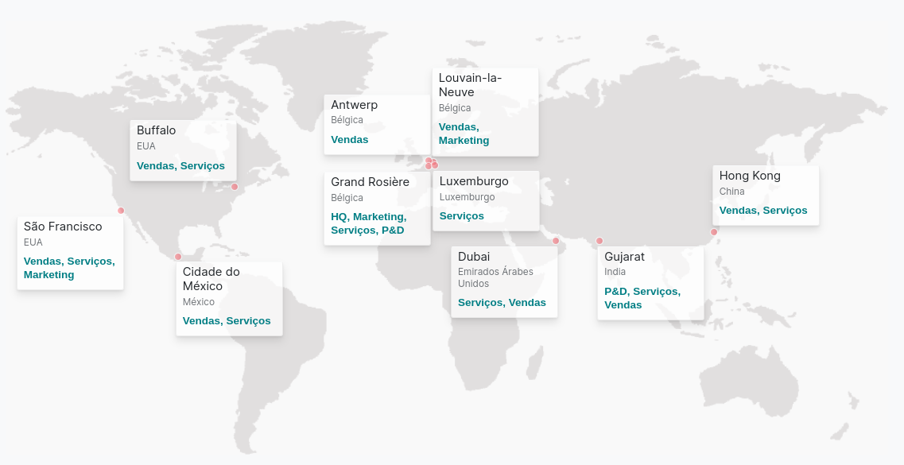
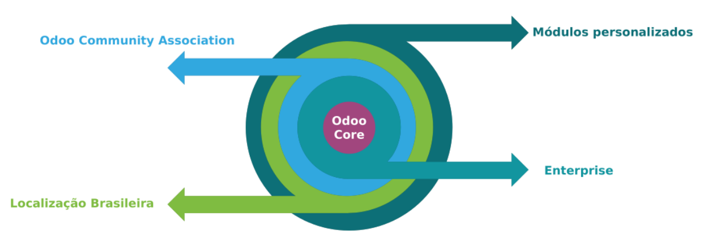

Comece por aqui
===============
Odoo

O que é o Odoo?
---------------

Primeiro precisamos distinguir os termos:

1. **Odoo SA:** Empresa que inventou o Odoo;
2. **Odoo Produto** / Core / Código;
3. **Odoo** Framework de Desenvolvimento RAD;
4. **Comunidade**.

Até por uma jogada de marketing da Odoo SA esses componentes tem nomes
parecidos.

.. nextslide::

.. tip::

     **Alem disso o Odoo / Odoo SA, tiveram vários nomes no passado:**
        -  2005: Tiny ERP;
        -  2010: OpenERP SA / OpenERP
        -  2014: Renomeada para Odoo, para se afastar do termos:
            -  Open;
            -  ERP.

**1.** Odoo S.A.
----------------

-  Site Oficial: http://www.odoo.com/
-  Visão: “Melhorando empresas, um aplicativo de cada vez.”
-  Missão: “\ **Acreditamos que softwares para gerenciar negócios devem
   cobrir necessidades complexas sem serem complicados. Nossa missão é
   fornecer soluções intuitivas, completas, integradas e fáceis de
   atualizar, enquanto funcionando sem problemas não só para o negócio,
   mas também para cada usuário.”**
-  Pais de Origem: Bélgica;
-  +1700 funcionários;
-  +3500 parceiros / revendedores;
-  +7 milhões de usuários;

.. nextslide::

-  Escritórios em todo o mundo.

   Escritórios da Odoo SA

Prêmios
~~~~~~~

-  **2010** *Prêmio Young Innovator INSEAD*
-  **2012** *A companhia belga melhor classificada na Deloitte
   Technology Fast50 Benelux* (crescimento de 1,549% nos últimos 5 anos)
-  **2012** *Prêmio Bossie* pela melhor solução em código aberto
-  **2013** *Prêmio Trends Gazelles*
-  **2013** *Prêmio Linux New Media* pela Melhor Solução de Código
   Aberto Compatível com Sistemas de Contabilidade Europeus
-  **2013** *Prêmio Bossie* pela melhor solução em código aberto
-  **2013** *L’Entreprise Prometteuse* por Ernst & Young

.. nextslide::

-  **2015** *Prêmio Bossie* pela melhor solução em código aberto
-  **2015** *Fabien Pinckaers* é eleito *um dos melhores líderes do ano*
   pela Le Soir
-  **2018** *Trends Gazelle Award* - Categoria de Pequenas e Médias
   Empresas
-  **2020** *“Deal of the Year”* por Trends-Tendances
-  **2021** *Fabien Pinckaers* é nomeado *líder do ano em 2020* pela
   Trends-Tendances

**Para informações atualizadas acesse:**
https://www.odoo.com/pt_BR/page/about-us\

Investimentos
~~~~~~~~~~~~~

A Odoo SA arrecadou um total de USD **319.1 M**

|

+-----------------+------------------------------+---------------+---------------------+
| Date            | Transaction                  | Money Raised  | Lead Investors      |
+=================+==============================+===============+=====================+
| Jul 29, 2021    | Private Equity Round - Odoo  | $215M         | Summit Partners     |
+-----------------+------------------------------+---------------+---------------------+
| Dec 17, 2019    | Secondary Market - Odoo      | $90M          | Summit Partners     |
+-----------------+------------------------------+---------------+---------------------+
| May 15, 2014    | Series B - Odoo              | $10M          | Sofinnova Partners  |
+-----------------+------------------------------+---------------+---------------------+
| Feb 16, 2010    | Series A - Odoo              | €3M           | Sofinnova Partners  |
+-----------------+------------------------------+---------------+---------------------+

Source: https://www.crunchbase.com/organization/odoo

2. Odoo Produto / ERP
---------------------

Odoo é um produto de software publicado pela Odoo SA.

O software Odoo é orientado pela empresa, o que significa que seu roteiro e
desenvolvimento são rigidamente controlados pela Odoo SA.

**No entanto, ainda segue os princípios de código aberto, e as
contribuições da comunidade para o código são bem-vindas.**

.. nextslide::

O software Odoo segue o modelo de negócios de **open core**, o que
significa que algumas partes do software são de código aberto e algumas
partes são proprietárias. Fruto deste modelo, a Odoo publica duas
edições:

.. nextslide::

-  A **Community Edition (CE)** está disponível publicamente, é de
   código aberto e licenciada sob LGPL.
-  A **Enterprise Edition (EE)** está disponível apenas para parceiros e
   clientes oficiais e possui uma licença proprietária que exige a não
   divulgação do código.

   Exemplo de estrutura de um projeto Odoo

.. nextslide::

O **Odoo EE** funciona como uma camada de módulos adicionais sobre o
núcleo **Odoo CE**, oferecendo recursos premium. (Falamos mais sobre
isso no módulo de comparação entre as versões)

Módulos por camada
~~~~~~~~~~~~~~~~~~

|

+-----------------+-----------------------------+-----------------------------------------------------------------+
| Qtd             | Camada                      | Link                                                            |
+=================+=============================+=================================================================+
| 293             | Odoo Community/Core         | `Github Core <https://github.com/odoo/odoo/tree/12.0/addons>`_  |
+-----------------+-----------------------------+-----------------------------------------------------------------+
| 190             | Odoo Enterprise             | `Github Closed <https://github.com/odoo/enterprise>`_           |
+-----------------+-----------------------------+-----------------------------------------------------------------+
| 2060            | Odoo Community Association  | `Loja OCA <https://odoo-community.org/shop/>`_                  |
+-----------------+-----------------------------+-----------------------------------------------------------------+
| 13540           | Terceiros                   | `Loja Odoo <https://apps.odoo.com/apps>`_                       |
+-----------------+-----------------------------+-----------------------------------------------------------------+

.. nextslide::

Odoo é uma plataforma de **código aberto** com todos os recursos para
criar aplicativos.

Com base nessa plataforma a **Odoo SA + Comunidade**, temos um
conjunto de aplicativos integrados, abrangendo funcionalidades como:

-  CRM;
-  Vendas;
-  Compras;
-  Inventário / WMS / Estoque;
-  Manufatura;
-  RH e Folha de Pagamento;
-  Ponto de Venda;

.. nextslide::

-  Financeiro;
-  Gestão de Projetos;
-  Planilha de horas;
-  Fiscal;
-  Contabilidade;
-  e muito mais!

.. seealso::

    Acesse o site oficial e explore as funcionalidades https://www.odoo.com/pt_BR

.. nextslide::

Além desses recursos prontos para uso, o Odoo é uma estrutura de
desenvolvimento de aplicativos criada com a extensibilidade em mente. 

Extensões e modificações podem ser instaladas através de novos
aplicativos, fazendo alterações em recursos existentes ou criando novas
funcionalidades independentes.

Isso evita a edição do código de recurso original e fornece aplicativos
personalizados limpos e fáceis de controlar. 

Essa capacidade de combinar vários módulos formando processos
customizados e o que forma a estrutura de um projeto de sucesso. 

3. Odoo Framework de desenvolvimento rápido
-------------------------------------------

Antes de entrar nos detalhes de como o Odoo ERP funciona vamos entender
um pouco mais sobre as questões técnicas.

3.1 Odoo: Quão rápido é desenvolver em Odoo? 
~~~~~~~~~~~~~~~~~~~~~~~~~~~~~~~~~~~~~~~~~~~~~

Rápido o suficiente para desenvolver um sistema de helpdesk em 1h30min.
. . Com SMS e integração com email.

|

..  youtube:: 9PJcBinFSQg

|

3.2 Quais os custos de licença de um projeto com Odoo?
~~~~~~~~~~~~~~~~~~~~~~~~~~~~~~~~~~~~~~~~~~~~~~~~~~~~~~

-  **ZERO**: \t\t        Se você usa o Odoo como uma plataforma de desenvolvimento rápido;
-  **ZERO**: \t\t       Se você usa o Odoo como uma plataforma de desenvolvimento rápido + **ERP** com somente os módulos de código aberto (+4000);
-  **Depende**: \t\t    Se você usa o Odoo como uma plataforma de desenvolvimento rápido + **ERP** com os módulos de código aberto e os Enterprise (+4000 200 = 4200): : https://www.odoo.com/pricing

.. nextslide::

.. warning::

     Considerar custos:
        -  Hospedagem;
        -  Suporte/Sustentação;
        -  Migração para versões futuras;
        -  Implementação;
        -  Customização;
        -  etc.

**3.3 Odoo: Como um projeto é estruturado?**
~~~~~~~~~~~~~~~~~~~~~~~~~~~~~~~~~~~~~~~~~~~~

É como se você comprasse um novo celular, ele vem com algumas
funcionalidades simples, mas você pode instalar novos aplicativos,
customizando o seu celular com suas necessidades.

**Funcionalidades standard:** 

-  Enviar e receber email;
-  Templates de email;
-  Agendar e atomatizar ações;
-  Loja de aplicativos;
-  Usuários / Grupos / Regras e Permissões de segurança;
-  Compartilhamento de dados com usuários externo;

.. nextslide::

-  Portal do cliente;
-  Dashboards e Relatórios;
-  API: XML-RPC / JSON-RPC / REST / GraphQL;
-  Import and Export Excel data.
-  etc;

3.4 Odoo: É possível desenvolver tudo que eu quiser?
~~~~~~~~~~~~~~~~~~~~~~~~~~~~~~~~~~~~~~~~~~~~~~~~~~~~

**Sim!** 

-  Criar seus próprios aplicativos;
-  Modificar aplicativos existentes:

   -  Criando novas funcionalidades;
   -  Modificando funcionalidades existentes; 

-  Criar seus próprio app, paginas web e widgets para exibir seus dados.
-  Usa-lo como um backend para aplicações mobile (REACT/ Angular / ETC);
-  Criar aplicativos Destkop e Mobile com tecnologia PWA;

.. nextslide::

-  Integrar com serviços externos:

   -  OpenLDAP, MS AD Directory, Oauth, etc.

-  Integrar com outros softwares:

   -  SAP;
   -  Sales Force;
   -  Magento;
   -  etc;

4. Odoo: Como aprender mais
---------------------------

- Leia a documentação oficial: https://www.odoo.com/documentation/
- Assista os videos de treinamento: https://www.odoo.com/slides
- Tire suas dúvidas e ajude outras pessoas: https://www.odoo.com/pt_BR/forum
- Explore o github: https://github.com/odoo
- Explore o github: https://github.com/oca
