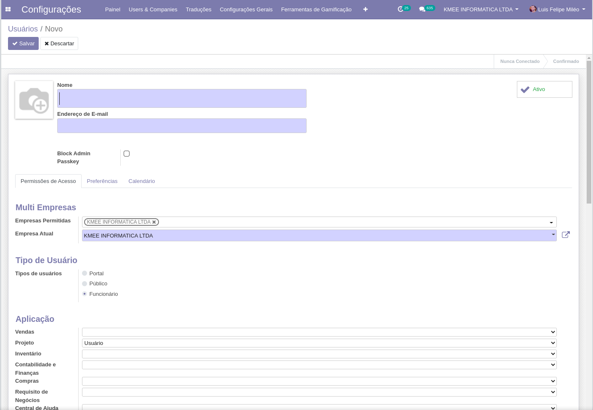
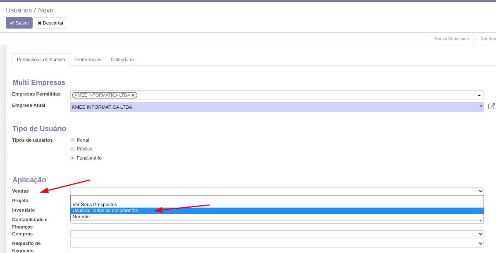
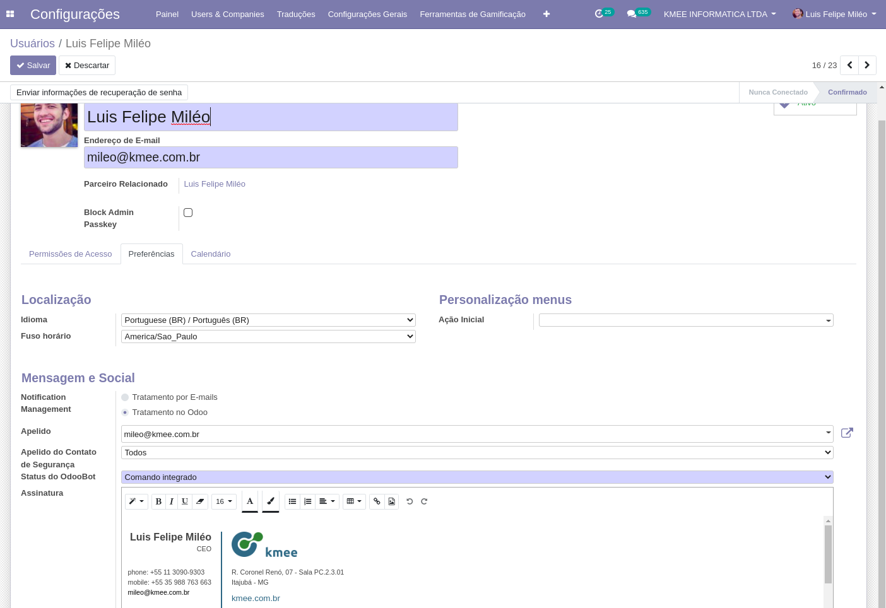
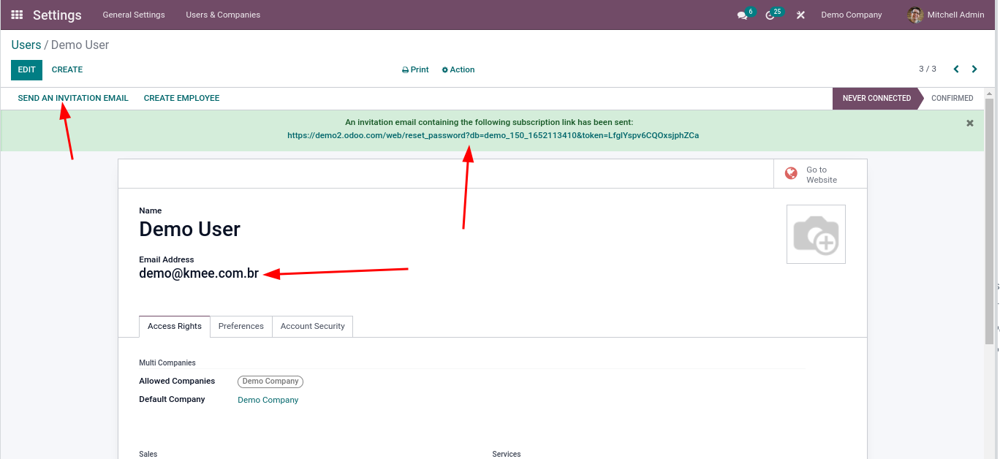
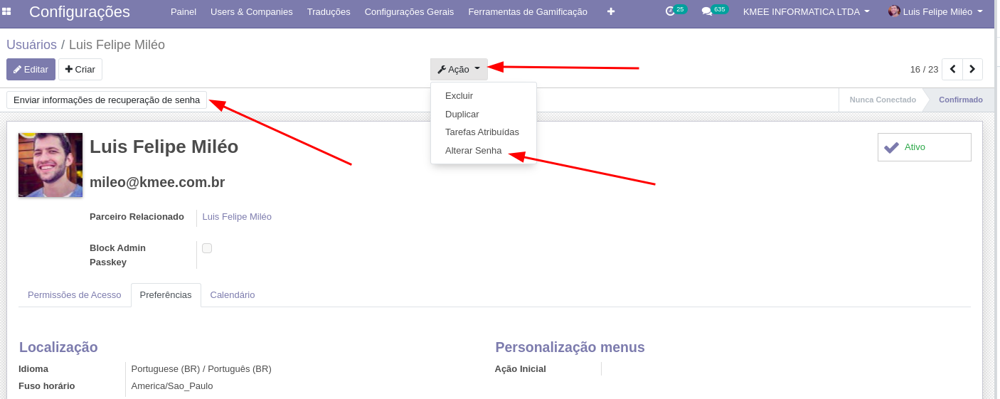

Configurações básicas
=====================

Usuários
--------

Para acessar o cadastro de usuários navegue através:

**Menu Principal > Módulo Configurações > Usuários & Empresas >
Usuários**

Tipos de usuários:
##################

-  **Interno:** Com acesso ao Backend;
-  **Portal:** Com acesso ao portal;
-  **Público:** Com acesso as áreas publicas que precisam de cadastro.

.. tip::

    Depois da versão 12, os usuários de portal e público não podem ser criados por esta interface, somente gerenciados.

Permissões de acesso:
#####################

Cada módulo tem um conjunto de permissões padrão que podem ser alocadas
aos usuários, sendo que as permissões são sempre em nível, e em ordem de
menos permissiva para mais permissiva.

.. nextslide::

Pois uma permissão de gerente de vendas por exemplo, sempre herdará as
permissões definidas nos níveis abaixo.

.. nextslide::

Preferências
############

.. nextslide::

Localização
###########

-  **Idioma do usuário:** Caso queira saber como ativar mais idiomas
   veja o próximo módulo;
-  **Fuso horário**: Todos os dados são salvos no banco de dados em
   formato UTC e este campo fuso horário é quem define como os dados
   serão exibidos para o usuário;

.. nextslide::

Personalização de menus
#######################

-  **Ação Inicial**: Por padrão o usuário é sempre redirecionado para o
   painel de comunicações, entretanto podemos direcioná-lo para qualquer
   menu do sistema, por exemplo um operador de estoque sempre que abrir
   o sistema pode ser redirecionado para as operações de estoque.

.. nextslide::

Mensagem e Social
#################

Neste grupo temos as configurações do módulo de comunicações:

-  **Gerenciamento de notificações:** Se o usuário vai lidar com as
   mensagens dentro do Odoo ou por email;
-  **Apelido/Alias:** Uma conta pode ter um alias de email associado a
   ela, por exemplo: *vendas@kmee.com.br*
-  **Status Odoo BOT:** Quando o usuário loga pela primeira vez o
   OdooBot interage com ele, este campo guarda a etapa de iteração em
   que usuário esta.
-  **Assinatura:** A assinatura das mensagens enviadas pelo usuário por
   e-mail para clientes / fornecedores por exemplo.

.. nextslide::

Ações:
######

-  **Enviar informações de recuperação de senha:** Este botão envia um
   e-mail para o usuário com um link para que ele redefina a senha, caso
   sua integração por e-mail não esteja 100% implementada, copie o link
   do header e envie manualmente.

.. nextslide::

-  **Ações > Alterar Senha**: Troca a senha atual do usuário por uma
   nova, não é preciso saber a senha anterior.
-  **Ativo / Inativo:** Desabilita o acesso do usuário
-  **Imprimir > Rótulo de usuário:** Quando o ponto de venda esta
   instalado, imprime o código de barras do crachá do usuário.

.. nextslide::

