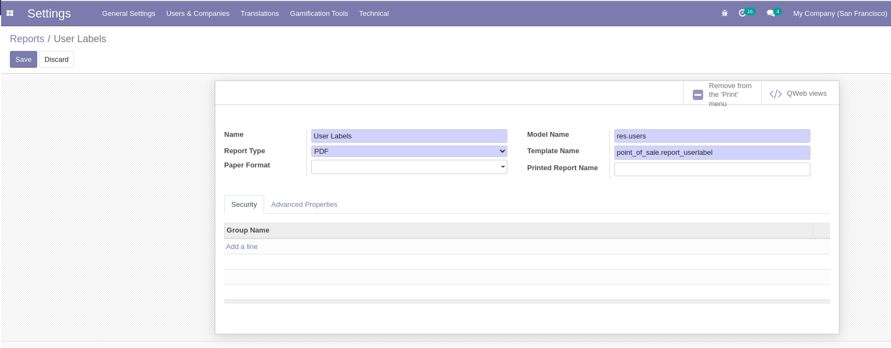

Configurações Técnicas
======================

O modo desenvolvedor
--------------------

1. Conecte em seu banco de dados (Não é necessário se conectar como
   admim, esta função esta disponível para todos os usuários, entretanto
   o admin tem mais ferramentas)
2. Clique no menu principal e acesse o módulo de **Configurações**
3. No lado inferior direito clique em **Activate developer mode**

.. nextslide::

.. nextslide::

Repare que a tag **?debug=1** é adicionada na URL!

.. attention::

    **Também é possível ativar o modo desenvolvedor alterando a URL:** Antes do #, insira: **?debug**.

    .. code-block::

        https://kmee.com.br/web#action=1494&active_id=mailbox_inbox&menu_id=1160
        **Altere para:**
        https://kmee.com.br/web?debug#action=1494&active_id=mailbox_inbox&menu_id=1160

.. warning::

    Você pode fazer isso diretamente na URL em qualquer link que estiver acessando.

Quando ativo
############

-  Acesso a configurações técnicas;
-  Você recebe dicas ao colocar o cursor em cima de um campo: nome
   técnico, tipo e etc;
-  Um menu drop-down é exibido no topo com informações técnicas, sobre o
   modelo exibido, as visões, ações, workflows, filtros e etc.

Debug with Assets
#################

Visando carregar o Odoo mais rápido, os “assets” JavaScript e CSS são
minificados o que dificulta o debug do cliente web. Para desativar esta
compactação existe o modo debug especial, com assets:

1. Clique no menu **Settings**
2. No lado inferior direito clique em **Activate developer mode with
   assets**

.. nextslide::

.. warning::

    **Também é possível ativar o modo desenvolvedor alterando a URL:**

    Antes do # sign, insira: ?debug=assets.

    .. code-block::

        https://kmee.com.br/web#menu_id=102&action=94
        **Altere para**
        https://kmee.com.br/web?debug=assets#…

Configurações Técnicas
----------------------

O menu configurações técnicas só fica acessível através do modo
desenvolvedor e pode acessado:

**Menu principal > Configurações > Técnico.**

Neste menu ficam boa parte das configurações do sistema, sendo que
muitas delas são criadas automaticamente quando instalamos um módulo.
Uma boa forma de entender como esses dados funcionam é instalando um
módulo e entendendo o que aparece nos registros.

OBS: Como a parte de emails é muito extensa e complexa, deixamos para um
módulo dedicado.

Ações
#####

As ações representam todas ações que podem ser chamadas pelo usuário:

**ir.actions.actions: Ações**
~~~~~~~~~~~~~~~~~~~~~~~~~~~~~

Ações disponíveis nos menus Ação dos modelos;

-  Exemplo: A ação de alterar uma senha do usuário;

**ir.actions.report: Relatórios**
~~~~~~~~~~~~~~~~~~~~~~~~~~~~~~~~~

Ações que chamam relatórios;

-  Exemplo: Imprimir o código de barras do cracha do ponto de vendas no
   cadastro de usuários;

   Report action: primeira aba

   Report action: Advanced Properties

-  **Name:** Nome do botão;
-  **Report Type:** Tipo de relatório: PDF, HTML, Excel e etc;
-  **Formato do Papel;**
-  **Model name:** Modelo base do relatório;
-  **Template name:** Nome técnico do template de relatório;
-  **Printed Report Name:** Nome do arquivo a ser salvo;

   -  OBS: podemos usar notação mako: **“((object.name or
      ’‘).replace(’/‘,’‘)+’.pdf’)**\ ”

-  **Security:** Grupo de usuários que poderão gerar o relatório;
-  **Advanced:**

   -  **Reload from Attachment:** Não emitir o relatório novamente e
      recarregar o relatório do anexo;
   -  **Save as Attachment:** Quando o relatório for gerado novamente,
      colocar um prefixo no nome do arquivo.

   Exemplo de report action

.. figure:: ./images/report-exported.png
   :alt: Relatório exportado do sistema
   :width: 800

   Relatório exportado do sistema

**ir.actions.act_window: Ações de Janela**
~~~~~~~~~~~~~~~~~~~~~~~~~~~~~~~~~~~~~~~~~~

São as ações que os botões chamam e elas determinam o comportamento
padrão da janela chamada:

.. figure:: ./images/window-action.png
   :alt: Ação da tela de pedidos de vendas
   :width: 800

   Ação da tela de pedidos de vendas

-  Qual modelo de negócio será exibido;
-  Quais tipos de visão serão exibidas;
-  Qual o filtro padrão;
-  Qual a busca padrão;
-  Os grupos que terão acesso a esta ação;
-  etc.

**ir.actions.server: Ações no Servidor**
~~~~~~~~~~~~~~~~~~~~~~~~~~~~~~~~~~~~~~~~

As ações de servidor são rotinas que podem ser chamadas através do menu
de ação e também através de ações agendadas. Sua principal
funcionalidade é ajudar o usuário a automatizar ações repetitivas, ou
ações complexas tornando-as simples.

As ações podem ser de vários tipos:

-  **Executam um código python;**
-  **Criam um novo registro,** por exemplo a partir de um chamado no
   módulo de Helpdesk, desejamos criar uma tarefa de projeto;
-  **Atualizam dados de um registro;**
-  **Executar múltiplas ações de servidor em sequência;**
-  **Enviar um e-mail;**
-  **Adicionar seguidores a um documento;**
-  **Criar uma próxima atividade;**
-  **Enviar uma mensagem de texto;**

   Executando uma ação de servidor para os registros selecionados

   Detalhes da ação de servidor.

ir.actions.todo**: Assistentes de Configuração*\*
~~~~~~~~~~~~~~~~~~~~~~~~~~~~~~~~~~~~~~~~~~~~~~~~~

Armazenam o estado atual de um assistente de configuração. Você pode
forçar o acionamento de um assistente já configurado novamente.

**ir.default: Padrões definidos pelo usuário**
~~~~~~~~~~~~~~~~~~~~~~~~~~~~~~~~~~~~~~~~~~~~~~

Salvam dados de padrões definidos no modo desenvolvedor.

Interface de usuário;
---------------------

-  Menus
-  Visões;
-  Visões customizadas;
-  Filtros definidos pelo usuário;
-  Tours;

Estrutura de dados
------------------

-  Precisão decimal;
-  Modelos;
-  Campos;
-  Campos de seleção;
-  Contraints de modelos no banco de dados
-  Relações many to many;
-  Anexos;
-  Logging do servidor;

Automação
---------

Ações automatizadas
###################

São ações que são executadas automaticamente quando:

-  Na criação de um registro;
-  Ao alterar um registro;
-  Ao criar e alterar;
-  Ao apagar;
-  etc.

Elas podem ter um filtro que restrinja sua execução.

 Exemplo: Toda vez que um novo produto for
criado avisar o setor fiscal da empresa por e-mail, para que o mesmo
verifique se a configuração esta correta. 

Ações Agendadas
###############

As ações agendadas são ações que o usuário pode agendar para ser
executada em um determinado horário, repetidamente ou não.

.. warning::

    Exemplos:

    -  Criar novos pedidos de compra em rascunho, com base nas variações de
       estoque de ultimo dia;
    -  Aprovar pedidos automaticamente provenientes de determinado canal;

Relatórios
----------

-  Formatos de papel;
-  Relatórios: Um segundo menu de **ir.actions.report** onde é possível
   editar o conteúdo dos relatórios;

Sequencias e identificadores
----------------------------

Identificadores externos:
#########################

Criam um link entre o nome externo dos registros e o id do registro no
sistema.

.. image:: ./images/metadata.png
   :width: 800

Parâmetros
----------

Em parâmetros encontramos parâmetros de configuração que mudam
comportamento de módulos, como os arquivos .INI / CFG de sistemas
desktop.

Alguns exemplos:

-  Permitir a autenticação externa de usuários;
-  Informações da licença do enterprise;
-  Data da criação do banco de dados;
-  UIID do banco de dados;
-  Configurações de catchall do email;
-  URL base do sistema;
-  etc.

.. warning::

    O módulo de relatórios as vezes não  renderiza corretamente o estilo e o header, pois verifica os parametros: **report.url** e o fallback **web.base.url**.
    Podemos então deixar o **web.base.url** como esta e setar um novo parâmetro **report.url como** http://0.0.0.0:8069.

Segurança
---------

Regras de registros:
####################

As regras de registros filtram os dados do sistema conforme a permissão
do usuário, por exemplo um vendedor só pode acessar os seus pedidos de
vendas:

.. figure:: ./images/record-rule.png
   :width: 800
   :alt: Regra faz parte do grupo de vendas: Somente ver seus documentos

   Regra faz parte do grupo de vendas: Somente ver seus documentos

Importante entender que as regras escondem registros que o usuário não
tem permissão de acessar, conforme a definição da regra e a mesma se
aplica ao grupo em que esta relacionada.

.. warning::

    Caso nenhum grupo for definido ela se torna uma regra global e portanto será aplicada para todos os usuários.

Regras de acesso
################

Depois que a regra de registro é aplicada, uma segunda validação é
aplicada, composta pelas regras de acesso.

.. warning::

    Por exemplo: Um vendedor pode criar e editar um pedido de vendas. Mas só pode ler o cadastro de produtos.

Recursos
--------

Recursos associam registros do sistema com a sua disponibilidade no
tempo, por exemplo:

-  Um funcionário está de férias quando?
-  Uma maquina esta ocupada ou disponível;
-  Um recurso pode atuar em determinado projeto?
-  Determinado dia é feriado?
-  etc.
