Interfaces de usuário
=====================
Odoo UX

Entendendo a interfaces de usuário
----------------------------------

No `módulo um <../index.html#instalando-o-odoo>`__ fizemos um overview da arquitetura do Odoo,
também falamos do que um pouco do que é possível fazer com o Odoo. 

Agora vamos nos aprofundar um pouco mais nas diferentes interfaces de
usuário.

Backend
-------

Começando pela mais conhecida delas e que faz com que o sistema seja tão
conhecido, a interface da retaguarda, ou comumente chamada de
**Backend**.

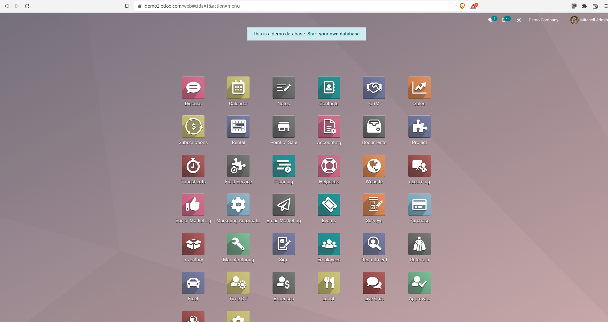

   Menu principal Odoo Enterprise

.. nextslide::

Esta é a área que somente os usuários internos, geralmente os
funcionários da empresa tem acesso, é onde os processos de negócio
ganham vida. 

.. tip::

    *Por exemplo onde um Pedido de Venda, onde um
    e-commerce o gerente de vendas consegue ver todas os pedidos feitos
    automaticamente pelo site, aprovar pedidos feitos manualmente por um
    vendedor pode gerar novas cotações manualmente, administrar e simular
    preços e etc;*

.. nextslide::

Esta interface tem características únicas e a primeira vista, parece ser
pouco mutável, mas você vai se surpreender do que ela é capaz.
Principalmente quanto instalamos módulos que à customizam.

Alem disso precisamos saber que a interface padrão do core do Odoo não é
tão bonita e prática. O Odoo Enterprise tem um módulo chamado
**web_enterprise** que melhora a interface de usuário.

Mas da mesma forma a OCA também mantem um módulo parecido que também
melhora a interface, o **web_responsive**.

Interface padrão:
#################

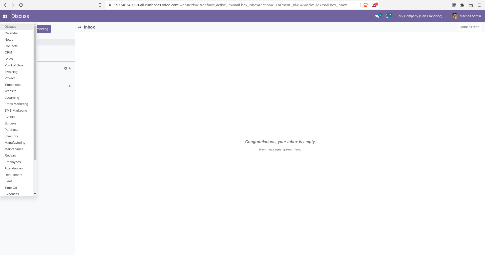

   Página inicial do core do Odoo, com um menu bem feio.

.. nextslide::

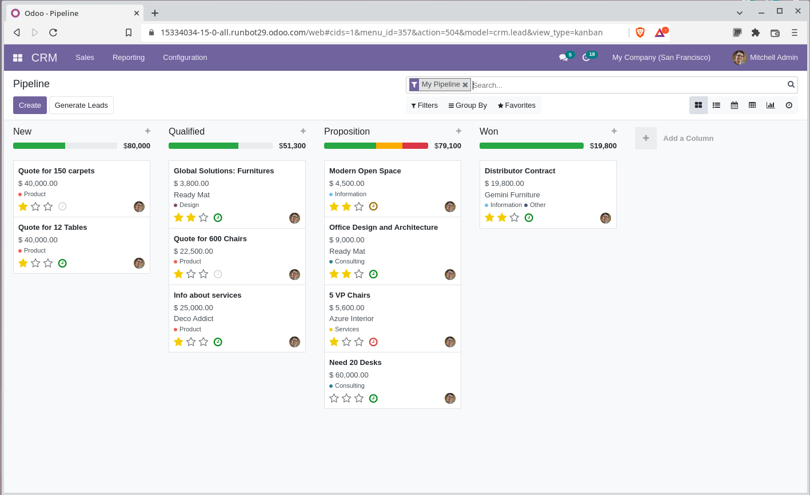

   Kanban do módulo CRM

Interface com **web_enterprise**
################################

   Página inicial com web_enterprise instalado

.. nextslide::

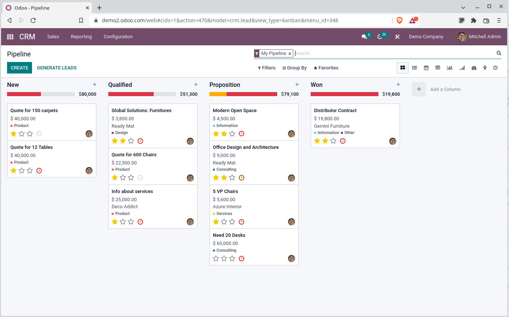

   Kanban do módulo CRM com web_enterprise instalado

Interface com **web_responsive**
################################

O módulo disponível no projeto: https://github.com/oca/web

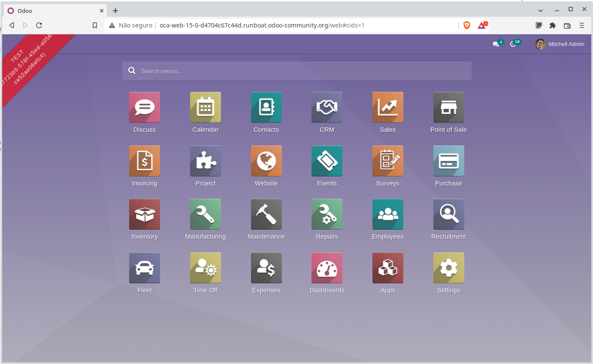

   Página inicial com web_resposive instalado

.. nextslide::

.. tip::

    Outros módulos que alteram a interface do
    backend podem ser encontrados na loja da Odoo SA:
    https://apps.odoo.com/apps/themes/category/Backend/browse

Navegação no Backend
####################

A navegação no backend tem algumas nuances vamos explorar algumas delas, menu principal e sub menus e diferentes tipos de visão;
   -  Listagem;
   -  Formulário;
   -  Kanban;
   -  Calendário;
   -  Pivot/Cubo;
   -  Atividades;
   -  Gráfico;
   -  Dashboard (Enterprise: **web_dashboard**);

.. nextslide::

-  Paginação;
-  Botão de Ação Rápida;
-  Botão de impressão;
-  Barra de pesquisa;

.. tip::

    Quando você precisar obter dados novos estiver
    visualizando a data de pesquisa não aperte F5/recarregar, apenas de um
    ENTER na tela de pesquisa.

    Isso evita o recarregamento do cliente web tornando a visualização ainda
    mais rápida.

.. nextslide::

.. tip::

    Esta mesma dica serve para o voltar do
    navegador, o sistema tem uma barra de navegação que salva o histórico,
    então quando você precisar voltar para um objeto anterior apenas clique
    na barra de breadcumbs.

O Portal
--------

O portal é uma área do sistema onde podemos compartilhar dados com
usuários externos, através de uma senha de acesso. 

Voltando ao exemplo anterior onde no backend um gerente visualiza todos
os pedidos de vendas da empresa. O portal é o local onde o cliente
consegue ver apenas os seus pedidos, como a área privada de um
e-commerce, geralmente com permissão de somente visualizar os dados,
saber o status do pedido e etc.

.. nextslide::

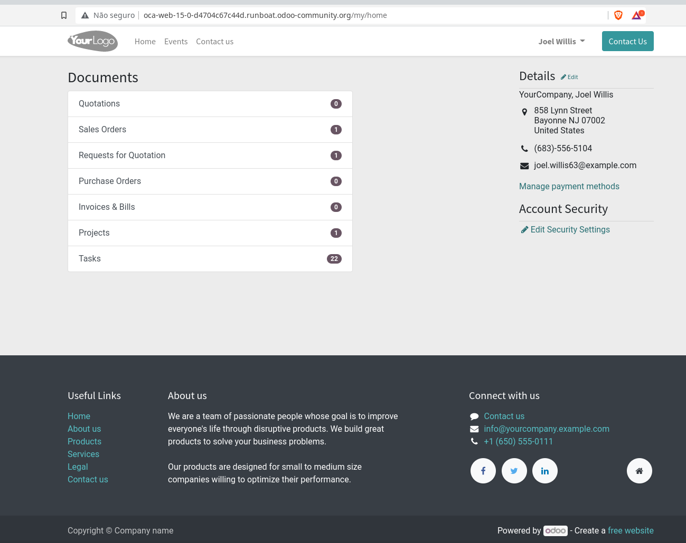

   Visão do Portal e os documentos que o usuário tem acesso

.. nextslide::

Alguns documentos permitem interação com o usuário, por exemplo um
pedido de compras solicitado pela empresa pode ser aprovador pelo
Fornecedor através do portal de compras.

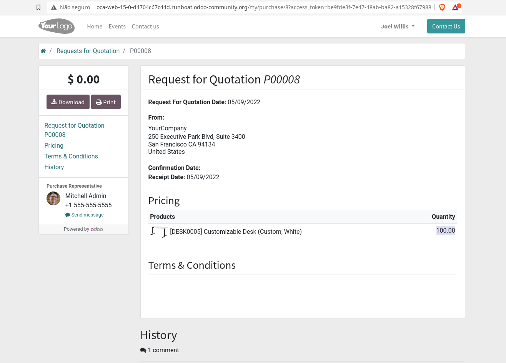

   Visão de uma RFQ nos documentos de compras.

O Frontend
----------

O Frontend atua como uma interface que geralmente não requer
autenticação, em um e-commerce representa a loja virtual, onde os itens
são expostos, os usuários podem fechar seus carrinhos de compras, se
cadastrar e e etc.

.. nextslide::

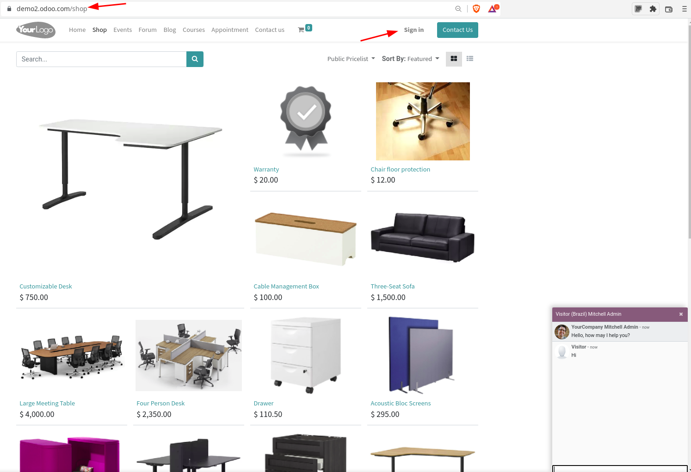

.. nextslide::

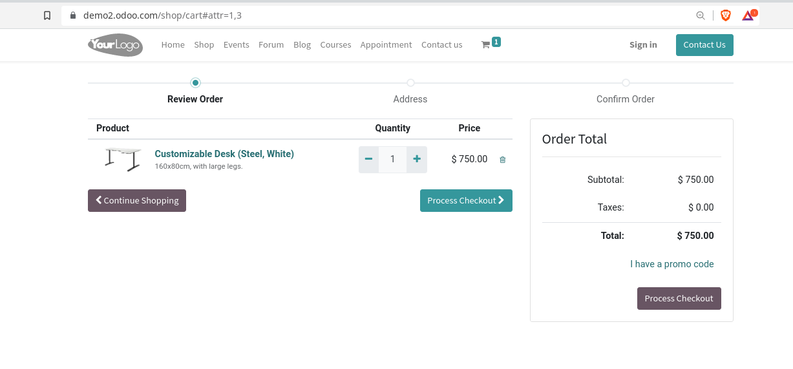

.. nextslide::

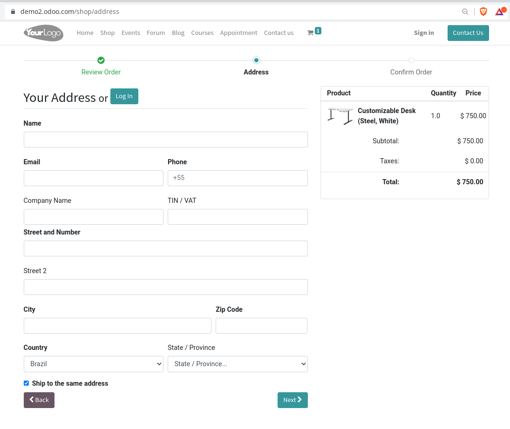

.. nextslide::

Essa é a interface que mais permite customização, pois não tem um layout
definido e onde podemos de certa forma abusar do uso de HTML e
Javascript, alem de interagir com as APIs “REST” do backend.

O Ponto de venda
----------------

O ponto de venda é uma interface a parte, construida em HTML e
Javascript com suas próprias especificidades sendo a principal delas o
funcionamento offline, mesmo que o backend esteja desligado, ou a
internet não esteja funcionando.

.. nextslide::

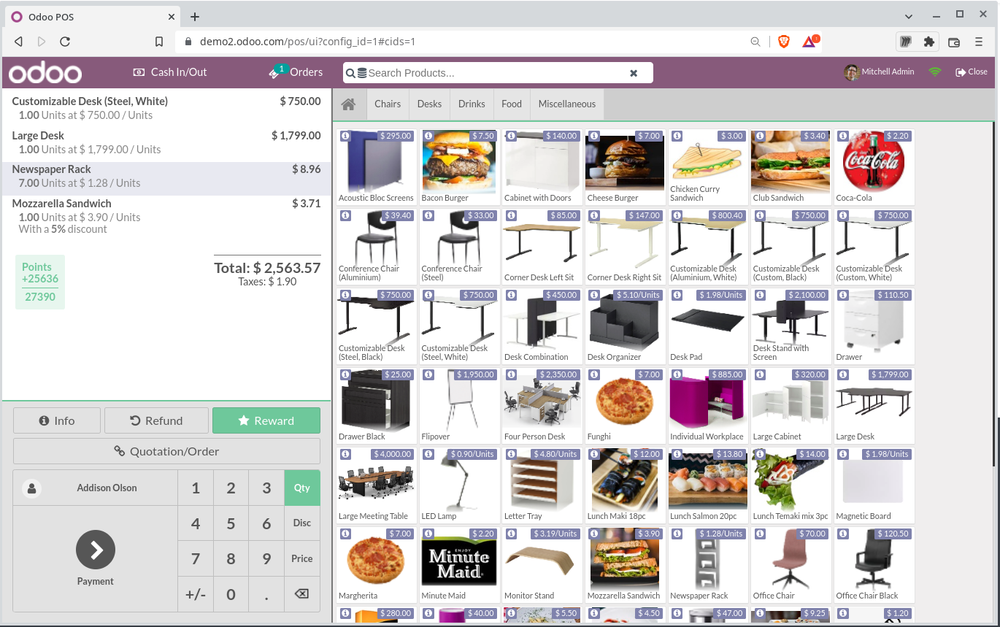

.. nextslide::

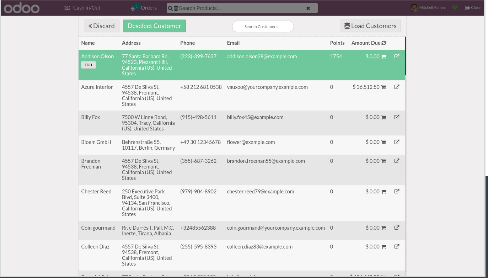

.. nextslide::

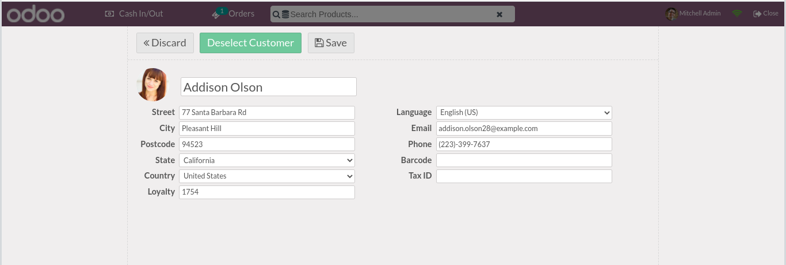

.. nextslide::

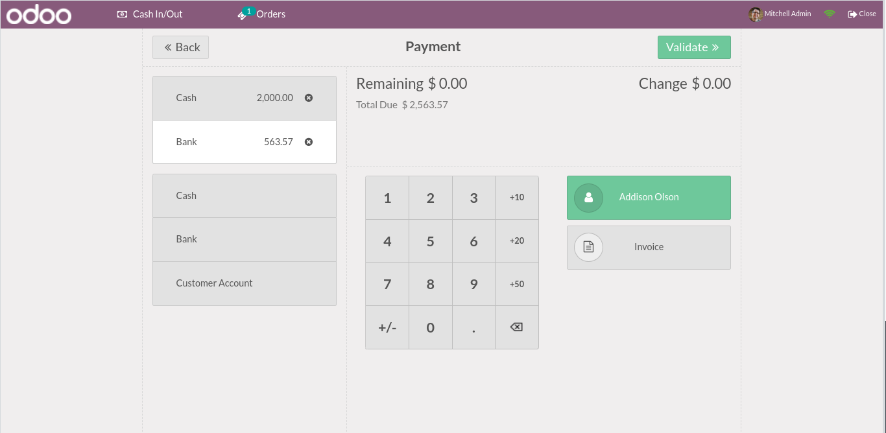

