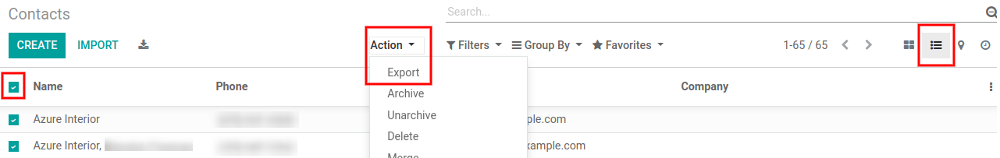
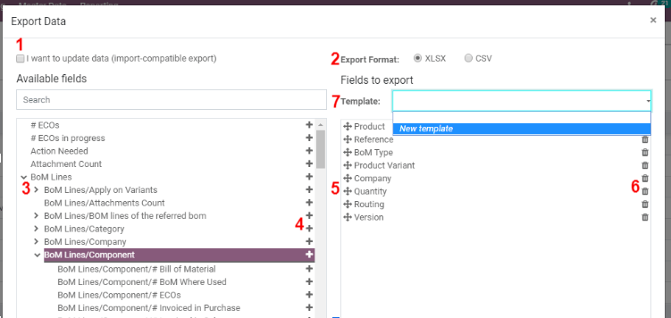
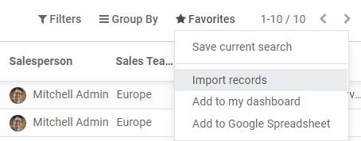
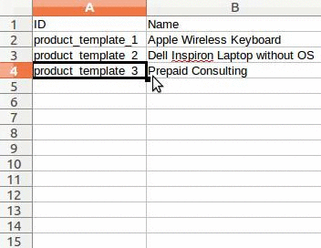
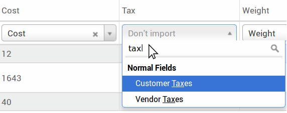

Importação e Exportação de dados
================================

-  Exportação de dados;
-  Identificadores externos;
-  Importação de dados;
-  Alteração de dados em Massa;

Exportar dados do Odoo
----------------------

Ao trabalhar com um banco de dados, às vezes é necessário exportar seus
dados em um arquivo distinto. Fazer isso pode ajudar a fazer relatórios
sobre suas atividades **(mesmo que o Odoo ofereça uma ferramenta de
relatório com cada aplicativo disponível).**

Com o Odoo, você pode exportar os valores de qualquer campo em qualquer
registro. 

**Para fazer isso, ative a visualização em lista dos itens que precisam
ser exportados, clique em**\ \_\ **Ação**\ \_*\* e, em seguida, em
**Exportar**.*\*

Bem simples, essa ação ainda vem com algumas especificidades. Na
verdade, ao clicar em *Exportar*, aparece uma janela pop-up com vários
opções para os dados a serem exportados:

   Visão geral dos dados que o usuário deseja exportar.

1. Com a opção *Quero atualizar os dados* marcada, o sistema apenas
   mostra os campos que podem ser importados. Isso é muito útil em caso
   você queira atualizar os registros existentes. Basicamente, isso
   funciona como um filtro. Deixar a caixa desmarcada dá muito mais
   campo opções porque mostra todos os campos, não apenas os que pode
   ser importado. 
2. Ao exportar, você pode escolher entre dois formatos: .csv e .xls. Com
   .csv, os itens são separados por vírgula, enquanto .xls contém
   informações sobre todos os planilhas em um arquivo, incluindo
   conteúdo e formatação.
3. Esses são os itens que você pode querer exportar. Use as setas para
   exibir mais opções de subcampo. Claro, você pode usar a barra de
   pesquisa para encontrar campos específicos com mais facilidade. Para
   usar a opção de pesquisa mais eficientemente, exiba todos os campos
   clicando em todos os Setas; flechas! 
4. O botão + está lá para adicionar campos à lista “para exportar”. 
5. As “alças” ao lado dos campos selecionados permitem mover os campos
   para cima e para baixo para alterar a ordem em que devem ser exibidos
   na exportação Arquivo. #. A lixeira está lá se você precisar remover
   campos. 
6. Para relatórios recorrentes, pode ser interessante salvar
   predefinições de exportação. Selecione todos os necessários e clique
   na barra de modelos. Lá, clique em *Novo modelo* e dê um nome ao seu.
   o da próxima vez que você precisar exportar a mesma lista, basta
   selecionar o modelo relacionado.

.. warning::
    É bom ter em mente o identificador externo do campo. Por exemplo, *Empresa Relacionada* é igual a *parent_id*. Isso ajuda a exportar apenas o que você gostaria de importar em seguida.

Importar dados para o Odoo
--------------------------

Como começar
~~~~~~~~~~~~

Você pode importar dados em qualquer objeto de negócios do Odoo usando o
Excel (.xlsx) ou CSV (.csv): contatos, produtos, extratos bancários,
lançamentos contábeis e até pedidos!

Abra a visualização do objeto que deseja preencher e clique em
:menuseselection:`Favorites –> Import registros».

Lá você recebe modelos que você pode preencher facilmente com seus
próprios dados. Esses modelos podem ser importados em um clique; O
mapeamento de dados já está feito.

Como adaptar o modelo
~~~~~~~~~~~~~~~~~~~~~

-  Adicione, remova e ordene colunas para se adequar melhor à sua
   estrutura de dados.
-  Aconselhamos a não remover o **ID** (veja o motivo na próxima seção).
-  Defina um ID exclusivo para cada registro, arrastando para baixo o
   sequenciamento de ID.

-  Quando você adiciona uma nova coluna, o Odoo pode não conseguir
   mapeá-la automaticamente se label não cabe em nenhum campo no Odoo.
   Não se preocupe! Você pode mapear novas colunas manualmente ao testar
   a importação. Pesquise na lista o campo correspondente.

Em seguida, use o rótulo deste campo em seu arquivo para fazê-lo
funcionar direto na próxima vez.

Como importar de outro aplicativo
~~~~~~~~~~~~~~~~~~~~~~~~~~~~~~~~~

Para recriar relacionamentos entre diferentes registros, você deve usar
o identificador exclusivo do aplicativo original e mapeie-o para a
coluna **ID** (ID externo) no Odoo. Quando você importa outro registro
vinculado ao primeiro, use **XXX/ID** (XXX/ID externo) para o
identificador exclusivo original. Você também pode encontrar este
registro usando seu nome, mas ficará preso se pelo menos 2 registros
tiverem o mesmo nome.

O **ID** também será usado para atualizar a importação original se você
precisar reimportar dados modificados posteriormente, é, portanto, uma
boa prática especificá-lo sempre que possível.
